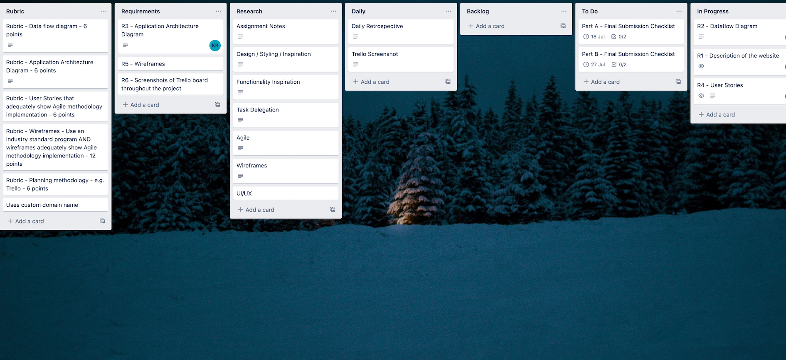
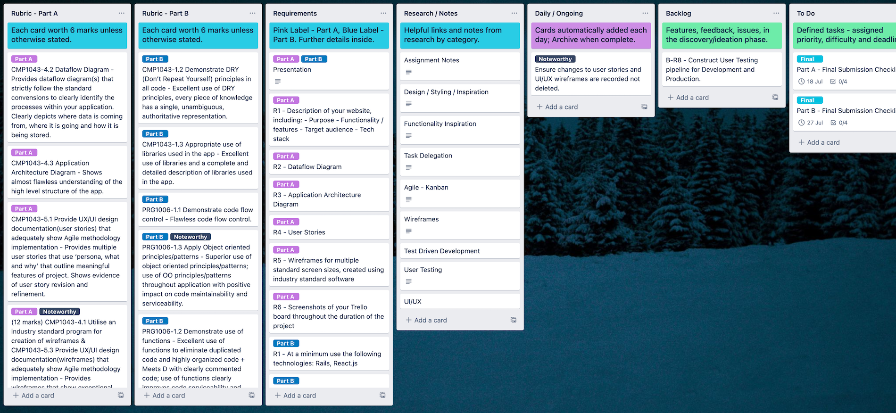

# Gym Membership Management System

## Client - 1UP Bouldering Gym

#### Term 3 Assignment 2 - Full Stack Application

#### Coder Academy - Fast Track Bootcamp

#### Developers - Katherine Rock & Garvey Chan

#### R10 - Deployed Website

**[1UP Bouldering Gym Portal](https://)**

#### R11 - Github Repositories

**[Front-End Repository](https://github.com/garveycodes/t3a2-full-stack-app-front)**
**[Back-End Repository](https://github.com/t3a2-full-stack-app-back)**

## Table of Contents

- **[R1 - Description](#description)**
  - **[Purpose](#purpose)**
  - **[Features](#features)**
  - **[Target Audience](#target-audience)**
  - **[Tech Stack](#tech-stack)**
- **[R2 - Dataflow Diagram](#dataflow-diagram)**
- **[R3 - Application Architecture Diagram](#application-architecture-diagram)**
- **[R4 - User Stories](#user-stories)**
- **[R5 - Wireframes](#wireframes)**
- **[R6 - Trello Board](#trello-board)**

## Description

#### Purpose

#### Features

#### Target Audience

#### Tech Stack

## Dataflow Diagram

## Application Architecture Diagram

## User Stories

## Wireframes

## Trello Board

##### [Link](https://trello.com/b/a1wC5ZhV/full-stack-app-t3a2-1up-bouldering)

**08/07/21 - Initialisation**

**09/07/21**

