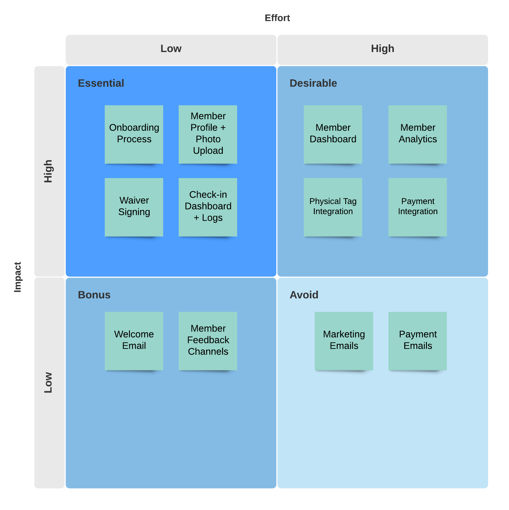

# Gym Membership Management System

## Client - 1UP Bouldering Gym

#### Term 3 Assignment 2 - Full Stack Application

#### Coder Academy - Fast Track Bootcamp

#### Developers - Katherine Rock & Garvey Chan

#### R10 - Deployed Website

**[1UP Bouldering Gym Application Portal](https://)**

#### R11 - Github Repositories

**[Front-End Repository](https://github.com/garveycodes/t3a2-full-stack-app-front)**
**[Back-End Repository](https://github.com/t3a2-full-stack-app-back)**

## Table of Contents

- **[R1 - Description](#description)**
  - **[Purpose](#purpose)**
  - **[Features](#features)**
  - **[Target Audience](#target-audience)**
  - **[Tech Stack](#tech-stack)**
- **[R2 - Dataflow Diagram](#dataflow-diagram)**
- **[R3 - Application Architecture Diagram](#application-architecture-diagram)**
- **[R4 - User Stories](#user-stories)**
- **[R5 - Wireframes](#wireframes)**
- **[R6 - Trello Board](#trello-board)**
- **_[Client Engagement](#client-engagement)_**
  - **_[Meetings](#meetings)_**
- **_[Project Management](#project-management)_**
  - **_[Planning Methodology](#planning-methodology)_**
  - **_[Delegation Methodology](#delegation-methodology)_**
  - **_[Feature Prioritisation](#feature-prioritisation)_**
- **_[Development Process](#development-process)_**
  - **_[Roadmap](#roadmap)_**
  - **_[User Testing Framework](#user-testing-framework)_**
  - **_[Automated Test Suite](#automated-test-suite)_**
  - **_[User Testing Results](#user-testing-results)_**
    - **_[Development Environment](#development-environment)_**
    - **_[Production Environment](#production-environment-with-client)_**
- **_[Website Screenshots](#website-screenshots)_**

## Description

### Purpose

The purpose of this application is to present an all-in-one solution for managing the membership-related operations of a **local bouldering gym** via an **intuitive web portal interface**. It is intended to cover **new member onboarding, profile management, check-in logs, data analytics, and payments integration**. The application is required to be **scalable** and **extendable**, with the potential for integration with **third-party systems** at a later date.

### Features

**Member Onboarding**
- Member Profile
- Membership Type
- Payment Details
- Waiver Signing
- Welcome Email

**Member Dashboard**
- Edit Profile
- Change Membership
- Update Payment Details
- Contact Gym Owner

**Check-in Dashboard**
- Third-party Tag System Integration
- Live Check-in View (Recent Check-in Displayed)
- Historical Check-in Logs

**Owner Dashboard**
- Basic Member Insights
- Raw Data Dump
- Outstanding Payments
- Feedback / Queries
- Marketing Emails (Promotions)

**Billing System**
- Third-party Payment Integration
- Payment Emails (Successful / Reminders / Missed)

### Target Audience

The target audience for this application is our client - **1UP Bouldering Gym**.

### Tech Stack

#### Front-End

- **ReactJS** - JavaScript library for building interactive User Interfaces.

- **TailwindCSS** - Utility-first CSS framework for styling.
  
- **Jest** - JavaScript testing framework.

- **Netlify** - Powerful git-based serverless platform for deployment.

#### Back-End

- **Ruby on Rails** - Server-side web application framework particularly useful for developing MVPs with quick time-to-market requirements.

- **Rspec Rails** - Testing library for Rails applications based on Rspec.

- **PostgreSQL** - Relational Database Management System.

- **Heroku** - Container-based Cloud Platform as a Service (PaaS) used to deploy, manage, and scale modern apps.

## Dataflow Diagram

## Application Architecture Diagram

## User Stories

## Wireframes

## Trello Board

#### [Link](https://trello.com/b/a1wC5ZhV/full-stack-app-t3a2-1up-bouldering)

**08/07/21**

**09/07/21**

## Client Engagement

### Meetings

#### Offline discussions

- Client has emphasised importance of having robust data analytics capability within the system - targeting membership demographics such as age, gender, locale and trends such as frequency of use, payment cycles, etc.
- Client would prefer membership tag system to be integrated into the application.

#### 11am Saturday 10/07/21

__Member payment frequency required:__

Daily

Weekly

Monthly

Annual

10-day passes 

__Payment methods__

As a small business, they need to be set up to accept all forms of payment, including cash.
Stripe offers payment subscription service and KR has implemented this previously. 
Brian was recommended Adyen. 
KR to research Adyen, compare with Stripe and recommend solution to client. 

__New member sign up process__

Client preference is for members to complete the sign-up process remotely before attending the gym. 
Members should also have access to sign-up using iPads provided at the gym or with the assistance of gym staff. 
Sign up process should also include the ability for members to upload their own photos or to take a photo using the gym’s iPads. 

__New member information__
Sign up process should capture:

•	Name

•	Date of birth

•	Address

•	Contact information

•	Emergency contact 

__Waiver__

Members need to sign waiver on sign up and again if there is an update to the waiver.
Periodic updates to the waiver are expected.
KR/GC to investigate use of electronic signatures. 
Database will need to include a table to capture the date or version number of the waiver and the date signed by each member. 

__Key features__

Easy to use interface for members and staff is high priority for client. 
Staff dashboard is high priority.
When a member checks in to the gym their profile and picture should be displayed to staff at reception. 
Payment integration is a high priority for the client. 
Client has experience previously of receiving all data in Excel for further manual review.
Plan is to provide data in excel format for the first iteration of the app along with a basic dashboard, with more detailed reports to be added later. 
Chat/queries between members and gym staff was not deemed a high priority by the client. 

The key features agreed for the initial version of the app are:

•	New member onboarding

•	Member Profile and Photo Upload

•	Waiver Signing

•	Check-in Dashboard and Logs

__Integrate existing data__

Due to Covid, the launch date of the gym cannot be confirmed. 
If the present app is not available in time for launch, an interim app will be used. 
KR/GC to investigate integrating data from the interim app into the current app. 

__Action Items__

KR to research Adyen, compare with Stripe and recommend solution to client.
KR/GC to investigate use of electronic signatures for members to sign waivers. 
KR/GC to investigate integrating data from the interim app into the current app if required. 

## Project Management

### Planning Methodology

<!-- describe workflow -->

### Delegation Methodology

<!-- describe strengths / weaknesses -->

### Feature Mapping

#### Prioritisation Matrix

#### Challenges & Difficulty Rating

- **Member Onboarding**
  - Difficulty - *Medium*
  - Challenges
    - 

- Member Profile
- Membership Type
- Payment Details
- Waiver Signing
- Welcome Email

- **Check-in System**
  - Difficulty - *Hard*
  - Challenges
    - 

- Third-party Tag System Integration
- Live Check-in View (Most recent check-in displayed, running log)
- Historical Check-in Logs

- **Member Dashboard**
  - Difficulty - *Medium*
  - Challenges
    - 

- Edit Profile
- Change Membership
- Update Payment Details
- Contact Gym Owner

- **Owner Dashboard**
  - Difficulty - *Medium*
  - Challenges
    - 

- Basic Member Insights
- Outstanding Payments
- Feedback / Queries
- Marketing Emails (Promotions)

- **Billing System**
  - Difficulty - *Hard*
  - Challenges
    - 

- Third-party Payment Integration
- Payment Emails (Successful / Reminders / Missed)

#### Minimum Viable Product

##### Core Functionality

- **Member Onboarding**
  - Member Profile
  - Membership Type
  - Payment Details
  - Waiver Signing

- **Check-in System**
  - Manual Check-in Portal
  - Live Check-in View (Most recent check-in displayed, running log)
  - Historical Check-in Logs 

##### Stopgap Solutions

Noting the limited time-frame for this assignment, we present stopgap solutions in lieu of more challenging features until they can be developed and deployed. Ideally these will be completed and tested prior to the launch of the gym.

- **Integrated Check-in System**
  - We could implement a temporary portal for members to check-in on entry using their name and date of birth.
- **Member Dashboard**
  - Members could sit down with the gym owner at the reception in order to have their details updated in the database.
- **Owner Dashboard**
  - Membership status and payment history could be manually reviewed on a regular basis.
- **Integrated Billing System**
  - Membership payments could be collected on entry.
- **Email Communication**
  - Members could be contacted via their phone numbers.

## Development Process

### Roadmap

<!-- Features -> User Stories -> Estimated Timelines -->

### Automated Test Suite

<!-- test-driven development guidelines -->

### User Testing Framework

<!-- describe workflow and tools (surveys, etc.) -->

### User Testing Results

#### Development Environment

#### Production Environment (with Client)

## Website Screenshots
