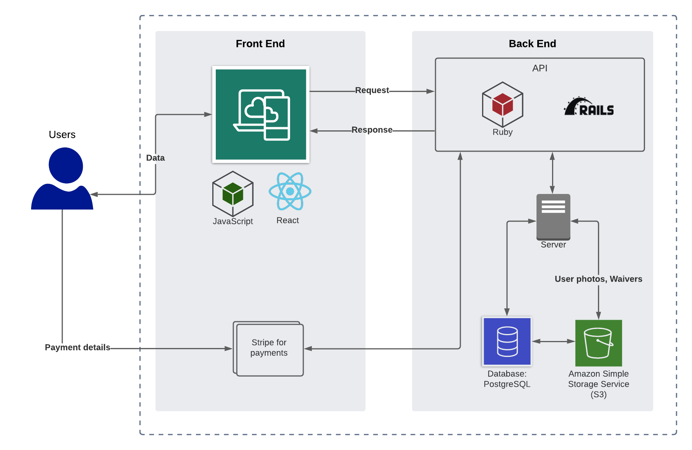
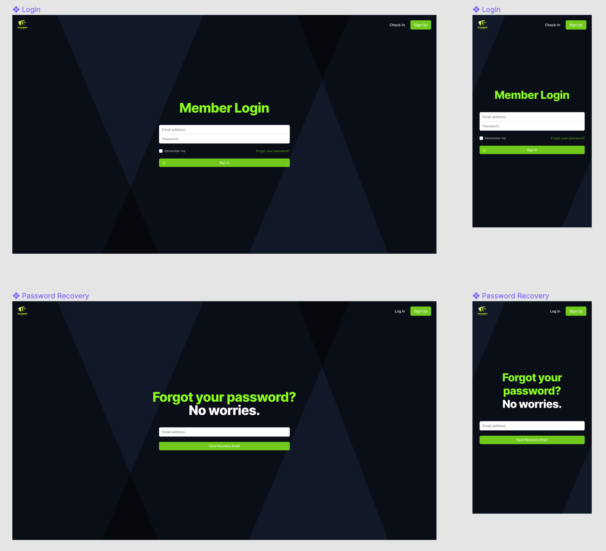
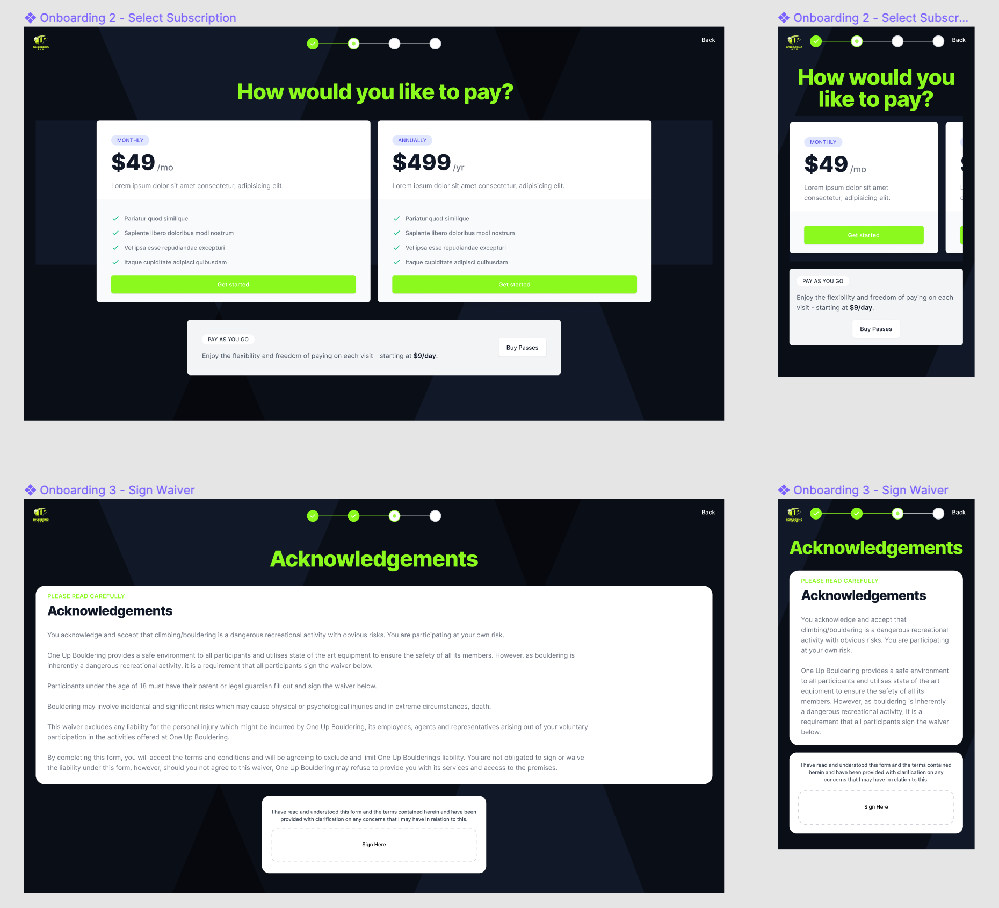
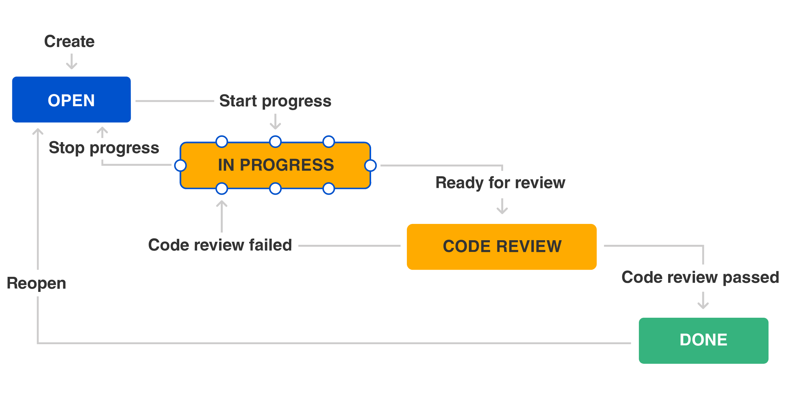

# Gym Membership Management System

## Client - 1UP Bouldering Gym

#### Term 3 Assignment 2 - Full Stack Application

#### Coder Academy - Fast Track Bootcamp

#### Developers - Katherine Rock & Garvey Chan

#### R10 - Deployed Website

**[1UP Bouldering Gym Portal](https://1upbouldering.app)**

#### R11 - Github Repositories

**[Front-End Repository](https://github.com/garveycodes/t3a2-full-stack-app-front)**

**[Back-End Repository](https://github.com/garveycodes/t3a2-full-stack-app-back)**

## Table of Contents

- **[R1 - Description](#description)**
  - **[Purpose](#purpose)**
  - **[Features](#features)**
  - **[Target Audience](#target-audience)**
  - **[Tech Stack](#tech-stack)**
- **[R2 - Data Flow Diagrams](#data-flow-diagrams)**
- **[R3 - Application Architecture Diagram](#application-architecture-diagram)**
- **[R4 - User Stories](#user-stories)**
- **[R5 - Wireframes](#wireframes)**
- **[R6 - Trello Board](#trello-board)**
- **_[Client Engagement](#client-engagement)_**
  - **_[Meetings](#meetings)_**
- **_[Project Management](#project-management)_**
  - **_[Planning Methodology](#planning-methodology)_**
    - **_[Blueprint](#blueprint)_**
    - **_[Development Process](#development-process)_**
    - **_[Communication](#communication)_**
  - **_[Delegation Methodology](#delegation-methodology)_**
    - **_[Tasks](#tasks)_**
    - **_[Performance](#performance)_**
  - **_[Feature Mapping](#feature-mapping)_**
  - **_[Prioritisation Matrix](#prioritisation-matrix)_**
  - **_[Challenges and Ratings](#challenges-and-ratings)_**
  - **_[Minimum Viable Product](#minimum-viable-product)_**
  - **_[Product Roadmap](#product-roadmap)_**
- **_[Further Diagrams](#further-diagrams)_**
  - **_[Entity Relationship Diagram](#entity-relationship-diagram)_**
  - **_[Visual Sitemap](#visual-sitemap)_**
<!-- 
- **_[Part B](#part-b)_**
  - **_[User Acceptance Testing](#user-acceptance-testing)_**
    - **_[Testing Framework](#testing-framework)_**
    - **_[Test Results](#results)_**
      - **_[Development Environment](#development-environment)_**
      - **_[Production Environment](#production-environment-with-client)_**
  - **_[Libraries Used](#libraries-used)_**
  - **_[Website Screenshots](#website-screenshots)_**
-->

## Description

### Purpose

The purpose of this application is to present an all-in-one solution for managing the membership-related operations of a **local bouldering gym** via an **intuitive web portal interface**. It is intended to cover **new member onboarding, profile management, check-in logs, data analytics, and payments integration**. The application is required to be **scalable** and **extendable**, with the potential for integration with **third-party systems** at a later date.

### Features

**Member Onboarding**
- Member Profile
- Membership Type
- Payment Details
- Waiver Signing
- Welcome Email

**Check-in System**
- QR Code / Email / Phone Number Check-in
- Live Check-in View (Recent Check-in Displayed)
- Historical Check-in Logs

**Member Dashboard**
- Edit Profile
- Change Membership
- Update Payment Details
- Contact Gym Owner

**Owner Dashboard**
- Basic Member Insights
- Raw Data Dump
- Outstanding Payments
- Feedback / Queries
- Marketing Emails (Promotions)

**Billing System**
- Third-party Payment Integration
- Payment Emails (Successful / Reminders / Missed)

### Target Audience

The target audience for this application is our client, **1UP Bouldering Gym**, and its membership base.

### Tech Stack

#### Front-End

- **ReactJS** - JavaScript library for building interactive User Interfaces.

- **TailwindCSS** - Utility-first CSS framework for styling.
  
- **Jest** - JavaScript testing framework.

- **Netlify** - Powerful git-based serverless platform for deployment.

#### Back-End

- **Ruby on Rails** - Server-side web application framework particularly useful for developing MVPs with quick time-to-market requirements.

- **Rspec Rails** - Testing library for Rails applications based on Rspec.

- **PostgreSQL** - Relational Database Management System.

- **Heroku** - Container-based Cloud Platform as a Service (PaaS) used to deploy, manage, and scale modern apps.

## Data Flow Diagrams

The following data flow diagrams represent the full app. A subset of these diagrams will serve as a reference for the minimum viable product.

**Level 0 data flow diagram showing a high level overview of data flow within the app:**

**Level 1 data flow diagrams showing the data flow for each process within the app:**

Member Onboarding:

Edit Member Profile:

Member Check-In:

Contact Gym Staff:

Admin User Sign Up:

Edit Admin User Account:

Check-In Sessions Dashboard:

View List of Members:

View Payment Status:

Respond to Member Queries:

## Application Architecture Diagram

## User Stories

|Epic|Story|
|:-:|:--|
|Member Onboarding| *As an owner, I want an intuitive frictionless sign-up interface, so I can quickly onboard new members.*   *As an owner, I want to capture individual member profiles, so I can leverage data analytics to improve my service offering.*   *As an owner, I want to shoot and store member photos, so I can verify their identity on entry.*   *As an owner, I want to provide multiple membership types, so my members have payment flexibility.*   ~~*As an owner, I want to collect member payment details, so I can set up recurring direct debits.*~~   ~~*As an owner, I want to display a waiver and collect digital signatures, so I can be sure that my members understand their rights.*~~   *As an owner, I want to present a waiver to new members and store attributed digital signatures, so I have an audit trail for my legal requirements.* |
|Check-in System| *As a member, I want to manually check-in with my email or phone number, in case I arrived at the gym without my QR Code.*   *As an owner, I want a live view of new check-ins, so I can evaluate each member entering the gym at a glance.*   *As an owner, I want to see a full historical log of check-ins, so I can identify any anomalous behaviour.*   As an owner, I want to generate a unique QR code for each member, so they can quickly scan it to check-in at the door. |
|Member Dashboard| As a member, I want to be able to edit my profile, so my details are always up to date.   As a member, I want the option to change my membership type, so I can be flexible with my billing cycle.   As a member, I want to edit my payment details in the portal, so I can avoid billing issues.   **As a member, I want a communication channel with the staff, so I can contact them if there are any issues.** |
|Owner Dashboard| As an owner, I want to view basic insights on membership data at a glance, so I can quickly identify systemic or business issues.   **As an owner, I want to have access to the raw membership data (csv format), so I can perform custom data analytics procedures.**   As an owner, I want to identify outstanding membership payments at a glance, so I can resolve issues before revenue is impacted non-trivially.   **As an owner, I want to communicate with my members via the application, to answer queries in a timely manner and improve brand perception.**   As an owner, I want to send mass marketing emails to selected or all members, so I can execute marketing strategies effectively. |
|Billing System| As an owner, I want to use a reputable third party payment system, so my billing process is frictionless and my members can be certain that their details are secure.   As a member, I want to receive emails regarding my membership payments, so I have a permanent record of invoices. |

*Notes -* 
- *italicised user stories represent the Minimum Viable Product.*
- *emphasised and crossed out user stories were updated following client feedback.*

## Wireframes

#### UI / UX Considerations

In developing the wireframes and prototypes for our application's front-end, we adhered to first principles of quality web design such as establishing a **visual hierarchy**, **F-shaped pattern reading** and **intuitive navigation**. These guidelines allowed us to construct user journeys with minimal friction that align with our client's requirements.

#### Prototypes

##### [Desktop Prototype](https://www.figma.com/proto/GpZg1xsCkVtwKkjgpk6l2K/Wireframes?node-id=3%3A206&scaling=scale-down&page-id=0%3A1&starting-point-node-id=3%3A206&hide-ui=1)

##### [Mobile Prototype](https://www.figma.com/proto/wSmxFUieO5vC3xvPgNf2aM/Wireframes-Mobile?page-id=0%3A1&node-id=3%3A206&scaling=scale-down&starting-point-node-id=3%3A206&hide-ui=1)

##### Laws of UX - Aesthetic-Usability Effect
  - Users often perceive aesthetically pleasing design as design that’s more usable.
  - In order to achieve this effect, we leverage TailwindCSS to build modern and performant styled components with thoughtful spacing, typography, shadows, and colour choices. 

#### Check-In Portal

##### Laws of UX - Fitts' Law
  - The time to acquire a target is a function of the distance to and size of the target.
  - The objective of the check-in portal is to provide an efficient way for members to signal their presence on entry to the gym.
  - As we want to avoid multiple gym entrants lining up on the terminals and causing delays, the key metric here is check-in time.
  - Fitts' Law has been applied in implementing the check-in functionality at the forefront of the portal, minimising the time required for members to identify themselves.

#### Login / Password Recovery

##### Laws of UX - Jakob's Law
  - Users will transfer expectations they have built around one familiar product to another that appears similar.
  - In this case, we implement universally recognised login and password recovery forms.

#### Member Onboarding

##### Functions
  - Instant input validation error message feedback.
  - Scrollable acknowledgements and waivers.

##### Laws of UX - Goal Gradient Effect
  - The tendency to approach a goal increases with proximity to the goal.
  - By displaying indicators at the top of each onboarding page, we provide a clear indication of progress in order to motivate users to complete the task.

#### Member Dashboard

##### Functions
  - Instant input validation error message feedback.

#### Admin Dashboard

##### Functions
  - Scrollable member list with pagination.
  - Search/filter members by keyword or attribute.

## Trello Board

#### [Link to Trello Board](https://trello.com/b/a1wC5ZhV/full-stack-app-t3a2-1up-bouldering)

**08/07/21**

**09/07/21**

**10/07/21**

**11/07/21**

**12/07/21**

**13/07/21**

**14/07/21**

**15/07/21**

**16/07/21**

**17/07/21**

**18/07/21**

**19/07/21**

**20/07/21**

**21/07/21**

## Client Engagement

### Meetings

#### Offline discussions

- Client has emphasised the importance of having robust data analytics capability within the system - targeting membership demographics such as age, gender, locale and trends such as frequency of use, payment cycles, etc.
- Client would prefer membership tag system to be integrated into the application.

#### 11am Saturday 10/07/21

## Project Management

### Planning Methodology

The planning of this project adheres to the principles of Agile project management, leveraging relevant techniques and methodologies to maximise the benefits of collaboration, respond quickly to client feedback and accelerate development speed.

#### Blueprint

In applying the principles of Agile, we first break our product down into its **core components**, using these to outline our **Epics** which we segment into individual **User Stories**. The **challenges** and **difficulty levels** of each user story are identified to support an **evidence-based** approach towards **estimating** each task's **resource requirements**. These data points can then be used to outline a **roadmap** for tracking and measuring **incremental progress** within the project timeline, allowing our plan to evolve as events unfold.

#### Development Process

By identifying the **constituent** pillars of our application and prioritising them to define our **Minimum Viable Product**, we allow ourselves to prepare incremental features and put them through our **user testing pipeline** - gathering important **feedback** and **adapting** our solution for new requirements. In doing so, we must also employ best practice coding principles to keep our features and modules **loosely coupled** in support of a more **maintainable** codebase.

*Credit: Atlassian*

#### Communication

Separate communication channels have been established, each pertaining to a major requirement of the project. Categorising the discussions in this way will prove helpful for **future reference**, particularly as the complexity of the project continues to grow. A separate channel has been created to serve as an **audit trail** for client engagement.

|Category|Channel|
|:--|:--|
|Client Engagement|General, Feedback, Meetings|
|Project Management|General, Docs & Design, Version Control, Development, User Testing, Production|
|Features|Profiles, Insights, Check-Ins, Payments, Styling|

### Delegation Methodology

The delegation of tasks within this project is executed and managed through the use of a traditional [**Kanban Board**](https://trello.com/b/a1wC5ZhV/full-stack-app-t3a2-1up-bouldering) on **Trello**. The Kanban approach was chosen for its **continuous flow**, with the expectation that project requirements will change as the development of the application progresses and **regular feedback** from user and client testing is incorporated. 

#### Tasks

Individual cards on the **Kanban board** will be distilled from the **Epic** being developed within that particular cycle. Each of these cards will align with a single **User Story**, broken down into **subtasks** and attached as a checklist. Having defined all user stories with consideration for their **challenges** and **difficulty**, each card will be delegated based on the developer's **familiarity** and **experience** with the subject matter.

#### Performance

**Cycle time** will be measured as a key metric for success in the project, helping to identify **bottlenecks** which can be resolved with **code review**, **pair programming** and **knowledge sharing**. A preliminary **Work In Progress (WIP) Limit** of 3 cards within the **review** state of the Kanban board will prevent the project from moving forward in the wrong direction as unresolved issues may necessitate a redesign of the application's underlying architecture. This limit will be reviewed with each **Daily Retrospective** and adjusted to match the throughput of the team.

*Credit: Atlassian*

### Feature Mapping

#### Prioritisation Matrix

#### Challenges and Ratings

- **Member Onboarding**
  - Difficulty - *Hard*
  - Challenges
    - Member Photo Upload
    - Digital Waivers and Signature Collection

- **Check-in System**
  - Difficulty - *Hard*
  - Challenges
    - QR Code Check-In Implementation

- **Member Dashboard**
  - Difficulty - *Medium*
  - Challenges
    - Staff Communication Channel

- **Owner Dashboard**
  - Difficulty - *Medium*
  - Challenges
    - Member Insights

- **Billing System**
  - Difficulty - *Hard*
  - Challenges
    - Third-Party Payment System
    - Recurring Payments
    - Physical Cash Register Integration

#### Minimum Viable Product

##### Core Functionality

- **Member Onboarding**
  - Member Profile
  - Membership Type
  - Payment Details
  - Waiver Signing

- **Check-in System**
  - Manual Check-in Portal (Email / Phone Number)
  - Live Check-in View (Most recent check-in displayed, running log)
  - Historical Check-in Logs 

##### Stopgap Solutions

Noting the limited time-frame for this assignment, we present stopgap solutions in lieu of more challenging features until they can be developed and deployed. Ideally these will be completed and tested prior to the launch of the gym.

- **QR Code Check-in System**
  - We could implement a temporary portal for members to check-in on entry using their email or phone number.
- **Member Dashboard**
  - Members could sit down with the gym owner at the reception in order to have their details updated in the database.
- **Owner Dashboard**
  - Membership status and payment history could be manually reviewed on a regular basis.
- **Integrated Billing System**
  - Membership payments could be collected on entry.
- **Email Communication**
  - Members could be contacted via their phone numbers.

### Product Roadmap

## Further Diagrams

### Entity Relationship Diagram

### Visual Sitemap

<!--

## Part B

### User Acceptance Testing

#### Testing Framework

#### Results

##### Development Environment

##### Production Environment (with Client)

### Libraries Used

### Website Screenshots

-->

